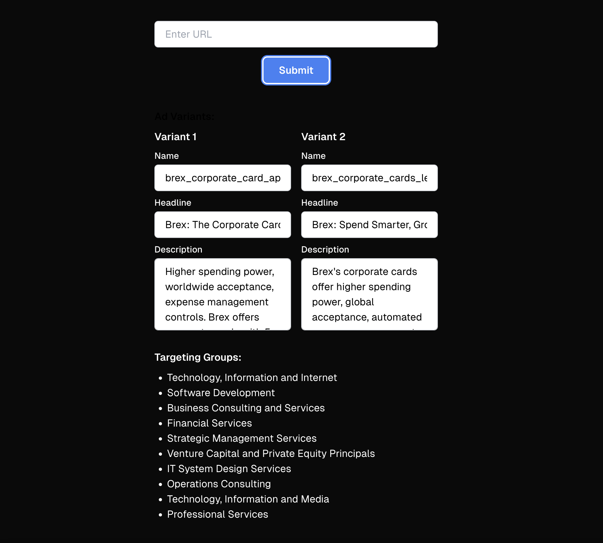

# Ad Generator

## Project Overview

Ad Generator is an AI-powered tool designed to create personalized advertisements based on user input. This project leverages advanced language models to produce unique and engaging ad content for B2B advertising.

## Architecture

The Ad Generator is built using Next.js API routes, while the frontend provides a user-friendly interface for interacting with the system. The main components are:

1. `src/app/api/process-page/route.ts`: Handles the main API endpoint for processing web pages and generating ad content.
2. `src/_server/ai/operations.ts`: Contains AI operations for extracting information and generating ad content.
3. `src/lib/schema.ts`: Defines the data schemas used throughout the application.
4. `src/app/page.tsx`: Implements the main user interface for inputting URLs and displaying generated ad content.



### Key Features

- Web page content extraction
- Company name extraction
- Product insights generation
- Ad copy generation
- Call-to-Action (CTA) selection
- Ad naming
- Targeting group selection
- User-friendly interface for inputting URLs and viewing generated ads

## API Endpoint

The main API endpoint is a POST request to `/api/process-page`. It accepts the following parameters:

- `url`: The URL of the webpage to analyze
- `variants` (optional): The number of ad variants to generate (default: 2, max: 10)

The endpoint returns:

- `adCreative`: An array of generated ad creatives
- `targeting`: Selected targeting groups

Example of returned data:


```json
{
    "adCreative": [
        {
            "ctaText": "Apply",
            "headline": "Brex: The Corporate Card Trusted by Startups & Enterprises",
            "description": "Empower your business with Brex - high spending power, smart controls, and automated expense management. Streamline travel, procurement, and more with global card acceptance and local currency options.",
            "name": "brex_corporate_card_apply",
            "destinationUrl": "https://www.brex.com/product/credit-card"
        },
        {
            "ctaText": "Apply",
            "headline": "Brex: The Corporate Card Elevating Startup Growth",
            "description": "Unlock higher spending power, smarter controls, and automated expense management with the Brex corporate card. Earn up to 7x rewards and get 24/7 global support to power your business forward.",
            "name": "brex_corporate_card_apply",
            "destinationUrl": "https://www.brex.com/product/credit-card"
        }
    ],
    "targeting": [
        {
            "name": "Software Development",
            "urn": "urn:li:industry:4",
            "value": {
                "segmentUrn": "urn:li:industry:4"
            },
            "category": "industry"
        },
        {
            "name": "Technology, Information and Internet",
            "urn": "urn:li:industry:6",
            "value": {
                "segmentUrn": "urn:li:industry:6"
            },
            "category": "industry"
        },
        {
            "name": "Financial Services",
            "urn": "urn:li:industry:43",
            "value": {
                "segmentUrn": "urn:li:industry:43"
            },
            "category": "industry"
        },
        {
            "name": "Venture Capital and Private Equity Principals",
            "urn": "urn:li:industry:106",
            "value": {
                "segmentUrn": "urn:li:industry:106"
            },
            "category": "industry"
        },
        {
            "name": "Capital Markets",
            "urn": "urn:li:industry:129",
            "value": {
                "segmentUrn": "urn:li:industry:129"
            },
            "category": "industry"
        },
        {
            "name": "International Trade and Development",
            "urn": "urn:li:industry:141",
            "value": {
                "segmentUrn": "urn:li:industry:141"
            },
            "category": "industry"
        },
        {
            "name": "Information Technology & Services",
            "urn": "urn:li:industry:3231",
            "value": {
                "segmentUrn": "urn:li:industry:3231"
            },
            "category": "industry"
        },
        {
            "name": "Credit Intermediation",
            "urn": "urn:li:industry:1673",
            "value": {
                "segmentUrn": "urn:li:industry:1673"
            },
            "category": "industry"
        },
        {
            "name": "IT System Design Services",
            "urn": "urn:li:industry:1855",
            "value": {
                "segmentUrn": "urn:li:industry:1855"
            },
            "category": "industry"
        },
        {
            "name": "Marketing Services",
            "urn": "urn:li:industry:1862",
            "value": {
                "segmentUrn": "urn:li:industry:1862"
            },
            "category": "industry"
        }
    ]
}

```

## AI Operations

The `aiOperations` object in `src/_server/ai/operations.ts` contains the following functions:

- `extractCompanyName`: Extracts the company name from the webpage content
- `extractProductInsights`: Generates product insights from the webpage content
- `generateAdName`: Creates a name for the ad based on its content
- `generateAdCTA`: Selects an appropriate Call-to-Action for the ad
- `generateAdCopy`: Generates the ad copy (headline and description)
- `selectTargeting`: Selects relevant targeting groups based on the webpage content

## Data Schemas

The project uses Zod for schema validation. Key schemas defined in `src/lib/schema.ts` include:

- `AdSchema`: Defines the structure of an ad
- `AdCopySchema`: Defines the structure of ad copy
- `TargetingSchema`: Defines the structure of targeting information

## Getting Started

To set up the Ad Generator backend locally, follow these steps:

1. Clone the repository
2. Navigate to the project directory
3. Install dependencies:
   
       npm install
   
4. Set up environment variables:
       - Copy the `.env.example` file to `.env`
       - Fill in the required API keys for OpenAI and other services

## Usage

To use the API endpoint:

1. Start the Next.js development server: `yarn dev`
   
2. On your browser open `http://localhost:3000/` 
3. Enter the URL of the webpage you want to generate an ad for
4. Click the "Generate Ad" button
5. See both your variants for that ad

## Limitations

- Currently only backend functionality is implemented
- Frontend interface is not yet developed
- Limited to B2B advertising content generation

## Technologies Used

- Next.js for the backend API routes
- OpenAI API for text generation
- Zod for schema validation
- TypeScript for type-safe development

